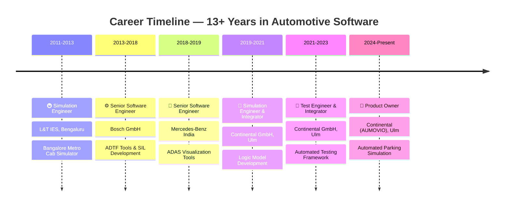

  

  &nbsp;
  &nbsp;
  

  &nbsp;
  
  
  
  

---

## 🧑‍💼 Professional Summary

Senior Software Engineer and Technical Product Owner with **13+ years** developing automotive ADAS **SIL simulation platforms** and **automated testing frameworks** for BMW, Tata Motors, and Nissan.

Owned product vision and roadmap for the *Open Loop Simulation Automated Parking* platform, defining release strategy and feature prioritization. Expert in:

- 🔬 **Simulation architecture** and end-to-end testing frameworks
- 🚗 **Perception & Sensor Fusion validation** (Radar, Camera, Ultrasonic)
- ⚙️ **CI/CD integration** (Jenkins, Docker) and data-driven quality measurement
- 📉 Achieved **20–30% reduction** in vehicle testing per program through comprehensive automated testing strategies

---

## � What I'm Currently Working On

- 🚗 Building next-gen **Open Loop Simulation** platform for Automated Parking at Continental
- ☁️ Scaling SIL infrastructure on **AWS (EKS, S3)** for distributed simulation workloads
- 🤖 Integrating **AI-powered code review** and automated defect detection into CI/CD
- 📚 Currently exploring: **Rust for safety-critical automotive systems** · **AUTOSAR Adaptive on Kubernetes**

---

## �🛠️ Skills

### 💼 Product & Leadership
| Area | Details |
|------|---------|
| Product Management | Roadmapping & strategy, backlog & feature prioritization |
| Stakeholder Management | Cross-functional team leadership, business & engineering interfaces |
| Agile / Scrum | Sprint planning, reviews, retrospectives, release planning |

### 💻 Programming Languages

### 🧪 Testing & Simulation

### 🚀 DevOps & Infrastructure

### 🚘 Automotive Protocols & Platforms
| Category | Technologies |
|----------|-------------|
| Protocols | CAN, CAN FD, FlexRay, Ethernet, UART, SOME/IP, DDS, Protobuf |
| Platforms & Tools | RTOS, QNX, CANoe, Lauterbach T32, AUTOSAR (Classic/Adaptive), ROS2, FMU/FMI, ADTF |
| Standards | ISO 26262, ASPICE, ADAS |
| Databases & OS | SQL, PostgreSQL, Windows, Linux (Ubuntu) |
| Management Tools | Jira, Confluence, DOORS, IBM Jazz |

---

## � GitHub Stats

  &nbsp;&nbsp;
  

  

---

## 📁 Key Projects & Repositories

> 💡 *Pin your best repositories on your GitHub profile! Here are the types of projects recruiters would love to see:*

| Project | Description | Tech Stack |
|---------|-------------|------------|
| 🅿️ **SIL Simulation Framework** | Open Loop Simulation platform for Automated Parking ADAS validation | C++, Python, eCAL, AWS |
| 🧪 **Automated Test Framework** | Modular testing framework with SIL/HIL integration for ADAS | Python, pytest, GTest, Jenkins |
| 📊 **Data Measurement Tools** | PyQt-based GUIs for test visualization and ADAS data analysis | Python, PyQt, Qt/QML |
| 🚇 **Metro Cab Simulator** | Realistic train operation simulation for Bangalore Metro | C++, Qt |

*→ Add links to your repositories above as you publish them!*

---

## 💼 Work Experience

### 📈 Career Journey

### 🏢 Product Owner — AUMOVIO (Continental GmbH), Ulm
**Jan 2024 – Present** · *Automated Parking (Open Loop Simulation)*

- 🎯 Owned product vision/roadmap; defined release strategy and feature prioritization for **6-person** cross-functional team
- 🏗️ Architected C/C++ & Python simulation platform with **AWS cloud integration**, reducing setup time by **40%**
- 🔁 Built Jenkins CI/CD pipelines cutting release cycles from **2 weeks → 3 days**; introduced AI-powered PR review

---

### 🏢 Software Test Engineer & Integrator — Continental GmbH, Ulm
**Aug 2021 – Dec 2023** · *Automated Testing Framework & Data Measurement Tools*

- 🧩 Designed modular automated testing framework achieving **85%+ test coverage** across SIL/HIL ADAS environments
- 🔌 Integrated BMW & Daimler toolchains (Lauterbach, CANoe, REST APIs), reducing manual regression testing by **60%**
- 🖥️ Developed **PyQt/Qt-based GUIs** accelerating test result interpretation by **3x**

---

### 🏢 Software Simulation Engineer & Integrator — Continental GmbH, Ulm
**Oct 2019 – Aug 2021** · *Logic Model Development (Open Loop Simulation)*

- 🔧 Developed logic models (OSI, C/C++11, Qt, Python) with seamless ECU integration; ensured BMW compliance
- 📋 Implemented structured testing with requirements traceability, reducing integration defects by **25%**

---

### 🏢 Senior Software Engineer — Mercedes-Benz India Pvt. Ltd.
**May 2018 – Sept 2019** · *ADAS Visualization & Measurement Tools*

- 🖥️ Developed ADTF/Qt visualization GUIs (C++, ROS) and ROS filters for bag capture/decoding across CAN, FlexRay, SOME/IP

---

### 🏢 Senior Software Engineer — Bosch GmbH
**Dec 2013 – Apr 2018** · *ADTF Tools & SIL Development*

- 🔧 Developed ADTF filters (C++) and Qt GUIs on Zynq/UltraScale platforms; mentored **4 junior engineers**

---

### 🏢 Simulation Engineer — L&T IES, Bengaluru
**Jul 2011 – Nov 2013** · *Bangalore Metro Cab Simulator*

- 🚇 Led end-to-end development of realistic train simulation system using **Qt and C/C++**

  <i>📄 <a href="RAVI_KUMAR_VANAMA_CV_PO.pdf">Download Full CV (PDF)</a> for detailed descriptions of all roles.</i>

---

## 🎓 Education

| Degree | Institution | Year |
|--------|-------------|------|
| **B.Tech** – Electronics & Communication Engineering | QIS College of Engineering, JNTU | 2009 |
| **MBA** – Project & Human Resource Management | Pondicherry University | 2015 |

---

## 📜 Certifications

| Certification | Issuer | Date |
|---------------|--------|------|
| **SAFe® 5 Product Owner / Product Manager** | Scaled Agile Framework® | Apr 2023 – Apr 2024 |
| **ISTQB®** International Software Testing Qualifications Board | ISTQB | Feb 2020 |

---

## 🌍 Languages

| Language | Level |
|----------|-------|
| English | C2 – Proficient |
| German | A2 – Elementary |

---

## 📋 Personal Details

- 🛂 **Work Authorization:** Germany Permanent Residence Permit *(work eligible)*
- 🚗 **Driving License:** German Class B *(incl. international permit)*

---

  

  <b>💡 Open to exciting opportunities in Automotive Software Engineering, ADAS Simulation, and Product Ownership.</b>  
  &nbsp;
  &nbsp;
  

